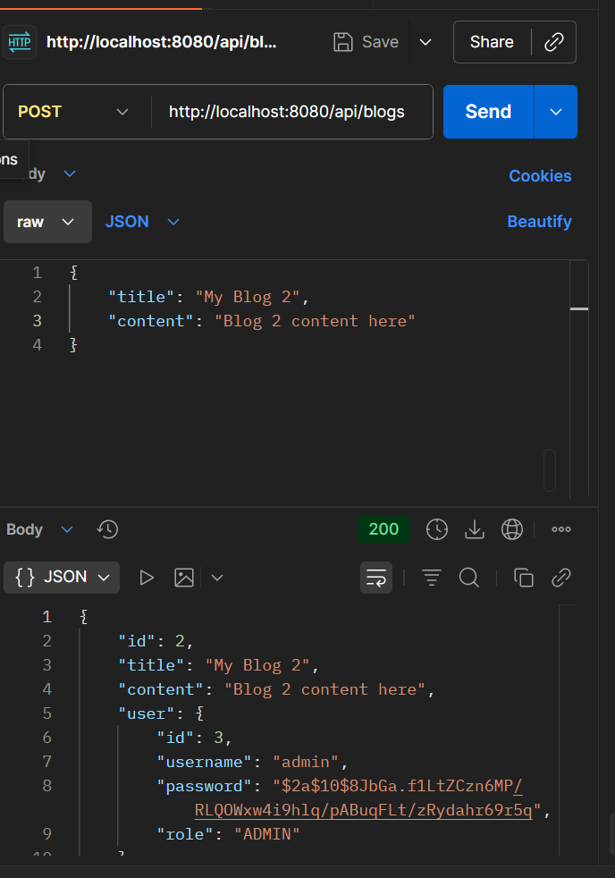

# Spring Boot JWT Authentication Demo

## Project Overview
This project demonstrates a secure REST API implementation using Spring Boot with JWT (JSON Web Token) authentication and role-based authorization (ADMIN/USER).

## Features
- User authentication with JWT
- Role-based authorization (ADMIN/USER roles)
- CRUD operations for users and blogs
- Secured endpoints with Spring Security
- Password encryption using BCrypt

## Tech Stack
- Spring Boot 3.x
- Spring Security
- JSON Web Token (JWT)
- Spring Data JPA
- H2 Database
- Maven

## Getting Started

### Prerequisites
- JDK 21
- Maven 3.6+
- Postman (for testing APIs)

### Running the Application
1. Clone the repository
2. Run the application:
```bash
mvn spring-boot:run
```
The application will start on `http://localhost:8080`

## API Documentation

### Authentication Endpoints

#### 1. Register User
```http
POST /api/auth/register
Content-Type: application/json

{
    "username": "admin",
    "password": "admin123",
    "role": "ADMIN"
}
```


#### 2. Login
```http
POST /api/auth/login
Content-Type: application/json

{
    "username": "admin",
    "password": "admin123"
}
```


### Protected Endpoints

> Note: All protected endpoints require JWT token in Authorization header:
> `Authorization: Bearer <your_jwt_token>`

### User Endpoints

#### 1. Get All Users
```http
GET /api/users
Authorization: Bearer <token>
```


#### 2. Get User by ID
```http
GET /api/users/{id}
Authorization: Bearer <token>
```

#### 3. Delete User (ADMIN only)
```http
DELETE /api/users/{id}
Authorization: Bearer <token>
```

### Blog Endpoints

#### 1. Create Blog
```http
POST /api/blogs
Authorization: Bearer <token>
Content-Type: application/json

{
    "title": "My Blog Title",
    "content": "Blog content here"
}
```



#### 2. Get All Blogs
```http
GET /api/blogs
Authorization: Bearer <token>
```

#### 3. Get Blog by ID
```http
GET /api/blogs/{id}
Authorization: Bearer <token>
```

#### 4. Update Blog (Owner only)
```http
PUT /api/blogs/{id}
Authorization: Bearer <token>
Content-Type: application/json

{
    "title": "Updated Title",
    "content": "Updated content"
}
```

#### 5. Delete Blog (Owner only)
```http
DELETE /api/blogs/{id}
Authorization: Bearer <token>
```

## Security Rules

### Role-Based Access Control
1. ADMIN Role:
   - Can perform all operations
   - Only ADMIN can delete users

2. USER Role:
   - Can view all blogs
   - Can create new blogs
   - Can only edit/delete their own blogs
   - Cannot delete users

### Authentication
- All endpoints except `/api/auth/**` require authentication
- JWT token must be included in Authorization header
- Token expires after 1 hour

## Database

The application uses H2 in-memory database with the following configuration:
- Console URL: `http://localhost:8080/h2-console`
- JDBC URL: `jdbc:h2:mem:testdb`
- Username: `sa`
- Password: `password`

## Testing with Postman

1. Register a new admin user:
```bash
curl -X POST http://localhost:8080/api/auth/register \
-H "Content-Type: application/json" \
-d "{\"username\":\"admin\",\"password\":\"admin123\",\"role\":\"ADMIN\"}"
```

2. Register a regular user:
```bash
curl -X POST http://localhost:8080/api/auth/register \
-H "Content-Type: application/json" \
-d "{\"username\":\"user\",\"password\":\"user123\",\"role\":\"USER\"}"
```

3. Login to get JWT token:
```bash
curl -X POST http://localhost:8080/api/auth/login \
-H "Content-Type: application/json" \
-d "{\"username\":\"admin\",\"password\":\"admin123\"}"
```

4. Use the token in subsequent requests:
```bash
curl -X GET http://localhost:8080/api/users \
-H "Authorization: Bearer <your_jwt_token>"
```

## Common Issues and Solutions

1. 403 Forbidden Error:
   - Check if you're using the correct JWT token
   - Verify you have the required role for the operation
   - Ensure the token hasn't expired

2. 401 Unauthorized Error:
   - Make sure you've included the Authorization header
   - Check if the token format is correct (Bearer prefix)
   - Verify your login credentials

3. Token Issues:
   - Tokens expire after 1 hour
   - Login again to get a new token
   - Include 'Bearer ' prefix in Authorization header